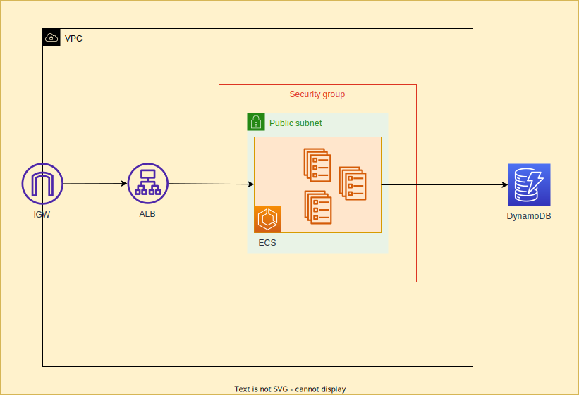

# FIAP Health&Med

This is a medical consultations system MVP made for FIAP Hackaton
Postgraduate degree in software architecture.

⚠️🎬[YouTube Video](https://youtu.be/zV6Mq8KY6eM)⚠️



## Requirements

- Docker
- Docker Compose

## Usage

Check docker-compose.yaml to see all the services.

- **Run**:

```sh
docker compose up
```

- **Stop**:

```sh
docker compose down -v
```

## Services

### Auth Service

```sh
.
├── Dockerfile
├── __init__.py
├── main.py
├── requirements.txt
└── src
    ├── adapters
    │   └── api.py
    ├── common
    │   └── dto.py
    ├── domain
    │   ├── exceptions.py
    │   └── services
    │       └── auth_service.py
    ├── infrastructure
    │   └── database
    │       └── dynamodb_auth_repository.py
    └── ports
        └── auth_repository.py
```

### Availability Service

```sh
.
├── Dockerfile
├── __init__.py
├── main.py
├── requirements.txt
└── src
    ├── adapters
    │   └── api.py
    ├── common
    │   └── dto.py
    ├── domain
    │   └── services
    │       └── availability_service.py
    ├── infrastructure
    │   └── database
    │       └── dynamodb_availability_repository.py
    └── ports
        └── availability_repository.py
```

### Appointment Service

```sh
.
├── Dockerfile
├── main.py
├── requirements.txt
└── src
    ├── adapters
    │   └── api.py
    ├── common
    │   └── dto.py
    ├── domain
    │   └── services
    │       └── appointment_service.py
    └── infrastructure
        └── database
            └── dynamodb_appointment_repository.py
```

## Deploy

Depending on the _Pull Request_ branch name pattern you will trigger a service test, build and publish a image to Docker Hub, so if i push a branch with pattern `feature:auth_service/_`it will trigger the`auth_service` workflow.
