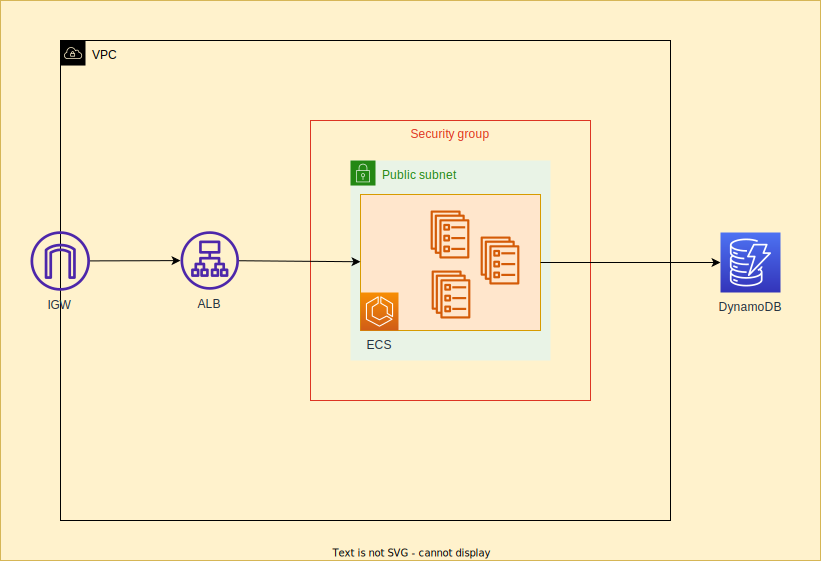

# FIAP Health&Med

This is a medical consultations system MVP made for FIAP Hackaton
Postgraduate degree in software architecture.

# Log in to Docker Hub

docker login

# Build and push Appointment Service

cd appointment_service
docker build -t dmenezesgabriel/appointment-service:v1 .
docker push dmenezesgabriel/appointment-service:v1
cd ..

# Build and push Auth Service

cd auth_service
docker build -t dmenezesgabriel/auth-service:v1 .
docker push dmenezesgabriel/auth-service:v1
cd ..

# Build and push User Service

cd user_service
docker build -t dmenezesgabriel/availability-service:v1 .
docker push dmenezesgabriel/availability-service:v1
cd ..
